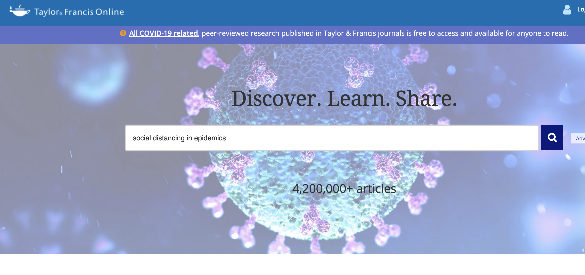
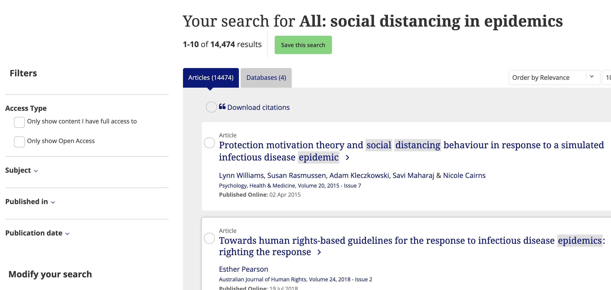
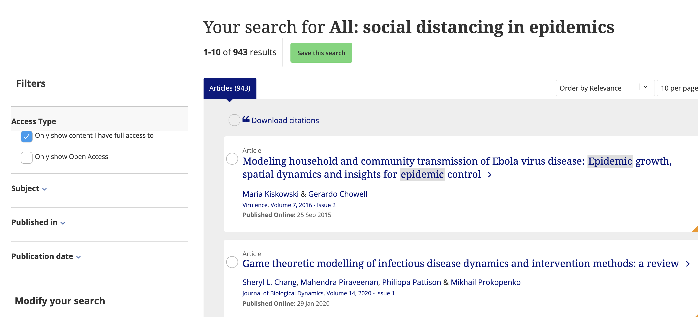

# Open Forum Europe 2020-04-28:1630

# *Peter Murray-Rust, OFA, University of Cambridge, ContentMine.org* 
(chemist, pharmaceutical, informatics, Open advocate for 25+ years)


# The problem
Knowledge is a core part of tacking the epidemic.We need every discipline, not just bioscience:

```
physics, chemistry, biology, medicine, materials, statistics,math, engineering , psychology, sociology, 
economics, law, philosophy, literature, art, sport, ...
``` 
Citizens (doctors, parents, local government, business, SMEs, policy makers,,,) fund the scientific literature 
(500 Billion of STEM research/year) and can't get answers. 

## Example
**"I want articles/evidence on social distancing in epdimemics".**

Go to Taylor and Francis (one of the big 5 publishers)

Ask for 

**`"social distancing in epidemics"`**

<hr/>



<hr/>

and get **14,474 hits**

<hr/>



<hr/>

Note you do NOT have to be an academic to understand these articles. Everyone in the world needs them:

But if you're an "ordinary citizen" you can only see **945 hits**:
(the closed ones cost 45 USD each).

<hr/>



<hr/>

**93.5% closed**
Between 70 and 95% of the scientific literature (depends on discipline) is closed. It's the same with other big 5 publishers (Elsevier, SpringerNature, Wiley, T+F, Sage).

**Open Access isn't working**

I assert that:
**PAYWALLS KILL PEOPLE** 

## ContentMine strategy

http:ContentMine.org is a ShuttleworthFoundation-funded non-profit, revitalised 3 weeks ago to mine the literature for facts and discussion to help fight the pandemic. Now unfunded, we've assembled a group of **Open Source volunteers** to:
* **create an Open Source crawler/scraper/converter** to normalize and index all the world'd scientific litertaure. Perhaps 15K documents / day. Journals, reviews, theses. Moving towards grey literature. Contributors:
* an **early warning system for new pandemics**

### software
* *picocli* CLI for Java. Remko Popka
* *Ferret*  Crawler/scraper
* *Clojure* toolkit
* *KN1ME* workflow engine
* *getpapers* Rick Smith-Unna
* *AMI* Peter Murray-Rust
and many Apache tools (PDFBox...), XOM, 

### sources
We've also pulled in 100,000 UK theses, 4.7 million OA abstracts, EuropePMC.org (Wellcome Trust and other charities), biorxiv.org and medrxiv.org

## proof of concept
We have POC ranging fron pre-alpha to good beta. None is productised.

See video below for screenshots.


## EUvsVirus Hackathon. 
We went to:
* find what was needed (not much software/informatics was displayed). We got one "customer"
* meet collaborators , find tools. Got 2 good collabs, some pointers.
* focus our own group. (motivated, focused, deadlines). worked very well.
* reach out. WE made a video (may be useful). Not expecting more.
* legitimize ourselves. The organizers understood and appreciated what we were doing. We hope to get a seal of approval.

### Video for EUvsVirus.org (2mins)
[](http://www.youtube.com/watch?v=gBFpiOs7wZI)

### Devpost report for EUVsVirus.org
[Our EUvsVirus report on Devpost](https://devpost.com/software/contentmine-scientific-knowledge-for-all)


### our feedback from Hackathon to OFE
* Huge event, very varied

* business focussed, EU flavour
* not set up as a traditional hack. More a marketplace./ competition.
* we were experienced but perhaps strange for first time hackers

# The future

## Paywalls are killing people. Can OFE help to move to total access to knowledge? 

The strategy is to make scientific search available to every citizen.

## We need software collaborators:
Much of the software is written but gaps in
* package tools for citizens (apps, Docker, etc.)
* volunteers to implement crawlers, write scrapers

## need designers and marketers
To productise this.

## we need advocates
* to take this to citizens with needs
* to show policy makers that Open can answer real questions.

The "open access" world will not gradually change the world for the better. It will rapidly put megapublishers in control of world scholarship.

Help


